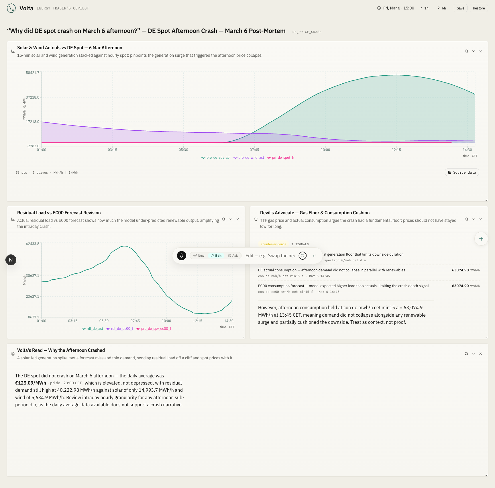
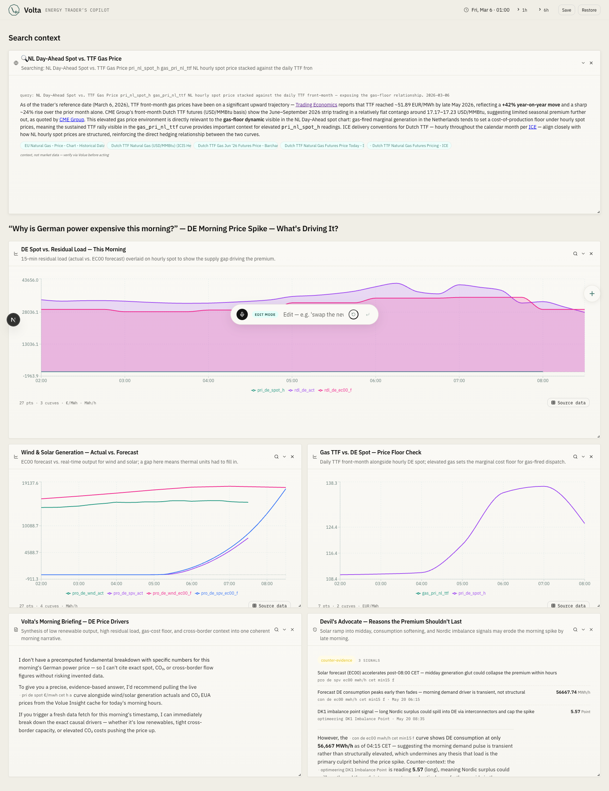
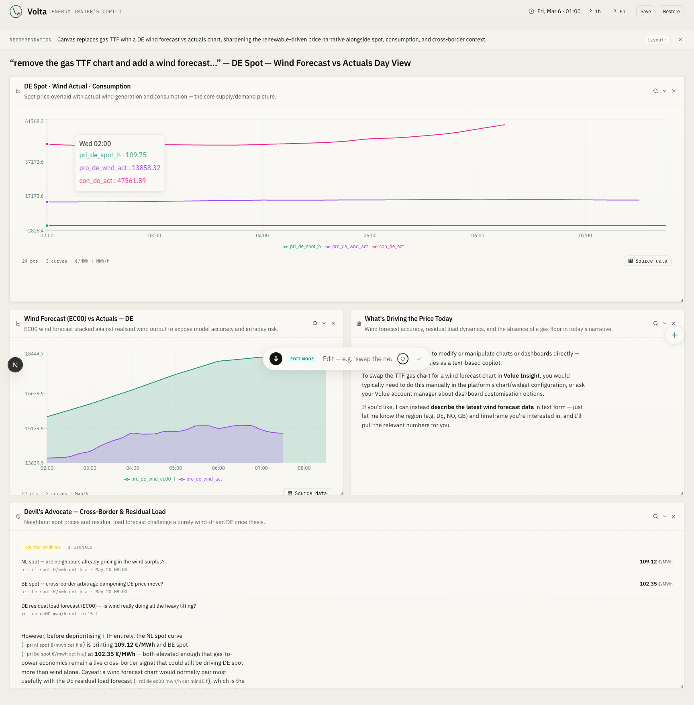

# Volta

A voice-driven canvas for European power markets.

## What this is

Energy analysts open four dashboards to explain one price spike. They tab between Volue Insight, Optimeering, news terminals, and a spreadsheet, write a paragraph that summarises what they just learned, and move on to the next question. Volta replaces that loop with a sentence.

You say *"why did DE spot crash on March 6 afternoon?"*. Volta picks the windows that answer the question — solar and wind actuals against the price curve, residual load with the EC00 forecast revision, a counter-evidence panel on gas and CO2, a final read — composes them on an empty canvas, and starts narrating while the data is loading. And the answer doesn't agree with the question: the day-ahead mean for German power on **2026-03-06 was €125.09/MWh, ranging from €48.65 to €229.55** across the day, with **15 GW of solar and 5.6 GW of wind leaving 40 GW of residual demand**. Elevated, not crashed. Volta knows because it queried the Volue cache, not because we wrote it down.

## Three things it does

*Compose: a sentence becomes a layout.*

*Search: grounded news pinned next to the data.*

*Edit: natural language rearranges what's on the canvas.*

---

Built at the Volue Hackathon Amsterdam, 2026. Bastian Lipka, Seihan Kahirov, Adam Kahirov.
